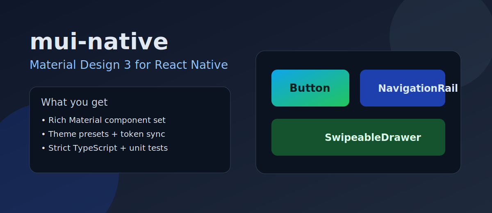
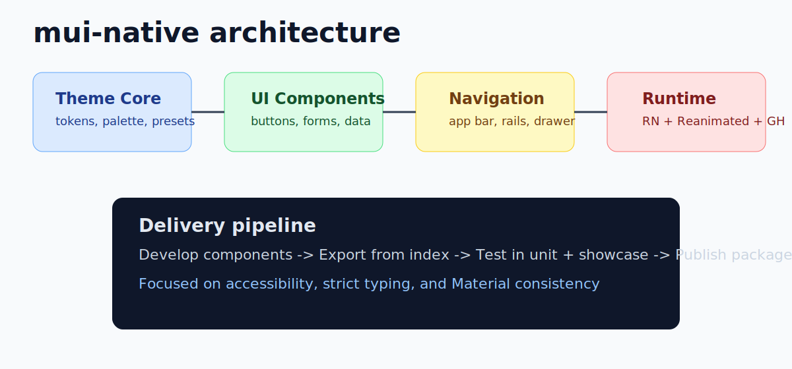
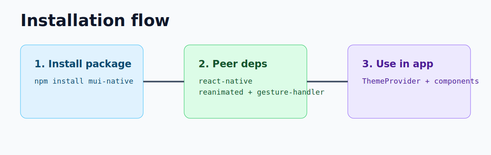
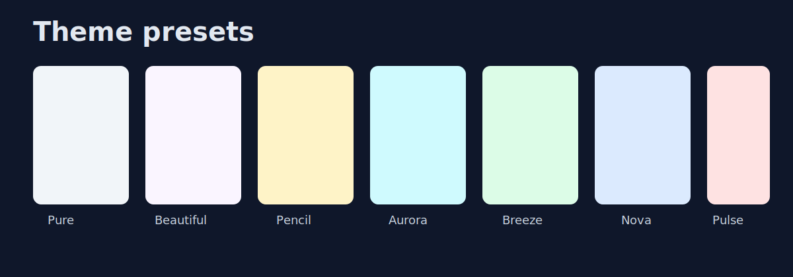
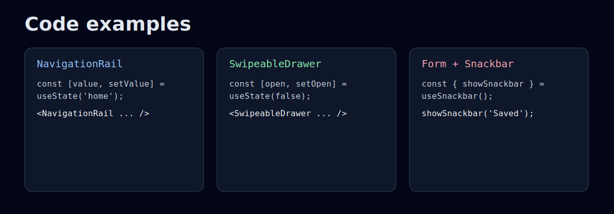
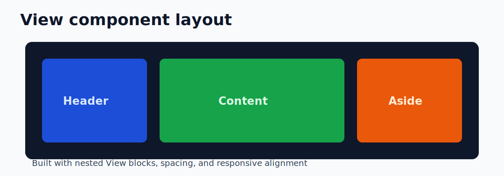
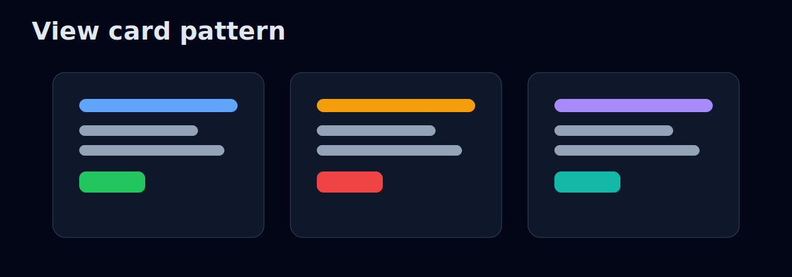
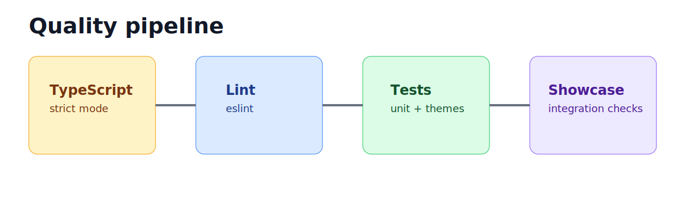

# mui-native

Material Design 3 component library for React Native.

mui-native provides a complete, themeable, production-ready UI foundation for React Native — with strict TypeScript, unit tests, Material Design components, and React Native primitive wrappers.



---

## Table of Contents

- [Why mui-native](#why-mui-native)
- [What's New — April 2026](#whats-new--april-2026)
- [Architecture](#architecture)
- [Installation](#installation)
- [Quick Start](#quick-start)
- [Theming](#theming)
- [Code Examples](#code-examples)
- [View Examples](#view-examples)
- [Component Catalog](#component-catalog)
- [Local Development](#local-development)
- [Quality](#quality)
- [Requirements](#requirements)
- [License](#license)

---

## Why mui-native

- Material Design 3 for React Native, ready to use out of the box.
- Centralized, stable public API exported from a single package entry point.
- Cross-platform theme presets (Android / iOS / Web).
- Unit test coverage across critical components.
- Built-in integration with `react-native-reanimated` and `react-native-gesture-handler`.

---

## What's New — April 2026

- Added missing React Native primitives: `View`, `Pressable`, `TextInput`, `Image`, `ImageBackground`, `ScrollView`, `FlatList`, `SectionList`, `VirtualizedList`, `RefreshControl`, `SafeAreaView`, `KeyboardAvoidingView`, `DrawerLayoutAndroid`, `TouchableOpacity`, `TouchableHighlight`.
- Added new Material Design components: `NavigationRail`, `SwipeableDrawer`.
- Added platform-specific theme presets with design token synchronization.
- Expanded unit tests and accessibility coverage.

---

## Architecture



---

## Installation



```bash
npm install mui-native
```

### Peer Dependencies

```bash
npm install react-native react-native-reanimated react-native-gesture-handler
```

---

## Quick Start

```tsx
import { ThemeProvider, Button, Text } from 'mui-native';

export default function App() {
  return (
    <ThemeProvider>
      <Button onPress={() => console.log('pressed')}>
        <Text>Hello mui-native</Text>
      </Button>
    </ThemeProvider>
  );
}
```

---

## Theming



```tsx
import { ThemeProvider, createTheme, NovaTheme } from 'mui-native';

const theme = createTheme({
  ...NovaTheme,
  mode: 'dark',
  colorScheme: {
    primary: '#6750A4',
  },
});

export default function App() {
  return <ThemeProvider theme={theme}>{/* app */}</ThemeProvider>;
}
```

### Available Presets

`PureTheme`, `BeautifulTheme`, `PencilTheme`, `AuroraTheme`, `BreezeTheme`, `NovaTheme`, `PulseTheme`

---

## Code Examples



### Controlled NavigationRail

```tsx
import { useState } from 'react';
import { NavigationRail } from 'mui-native';

const items = [
  { value: 'home', label: 'Home', icon: 'home' },
  { value: 'search', label: 'Search', icon: 'search' },
  { value: 'settings', label: 'Settings', icon: 'settings' },
];

export function RailExample() {
  const [value, setValue] = useState('home');

  return (
    <NavigationRail
      items={items}
      value={value}
      onChange={setValue}
      ariaLabel="Main navigation"
    />
  );
}
```

### Temporary SwipeableDrawer

```tsx
import { useState } from 'react';
import { Button, SwipeableDrawer, Text, Box } from 'mui-native';

export function DrawerExample() {
  const [open, setOpen] = useState(false);

  return (
    <>
      <Button onPress={() => setOpen(true)}>
        <Text>Open drawer</Text>
      </Button>

      <SwipeableDrawer
        open={open}
        onClose={() => setOpen(false)}
        onOpen={() => setOpen(true)}
        anchor="left"
      >
        <Box sx={{ p: 2 }}>
          <Text>Drawer content</Text>
        </Box>
      </SwipeableDrawer>
    </>
  );
}
```

### Simple Form with TextInput

```tsx
import { useState } from 'react';
import { Box, Button, Text, TextInput } from 'mui-native';

export function FormExample() {
  const [email, setEmail] = useState('');

  return (
    <Box sx={{ gap: 2, p: 2 }}>
      <TextInput
        placeholder="name@company.com"
        value={email}
        onChangeText={setEmail}
        keyboardType="email-address"
      />
      <Button disabled={!email.includes('@')}>
        <Text>Submit</Text>
      </Button>
    </Box>
  );
}
```

### Snackbar via Hook

```tsx
import { Button, SnackbarHost, Text, useSnackbar } from 'mui-native';

function SaveButton() {
  const { showSnackbar } = useSnackbar();

  return (
    <Button onPress={() => showSnackbar('Settings saved')}>
      <Text>Save</Text>
    </Button>
  );
}

export function SnackbarExample() {
  return (
    <>
      <SaveButton />
      <SnackbarHost />
    </>
  );
}
```

---

## View Examples



### Page Layout with View

```tsx
import { View, Text } from 'mui-native';

export function ViewLayoutExample() {
  return (
    <View style={{ flex: 1, padding: 16, gap: 12 }}>
      <View style={{ height: 64, borderRadius: 12, backgroundColor: '#1d4ed8', justifyContent: 'center', paddingHorizontal: 12 }}>
        <Text style={{ color: 'white' }}>Header</Text>
      </View>

      <View style={{ flexDirection: 'row', gap: 12, flex: 1 }}>
        <View style={{ flex: 2, borderRadius: 12, backgroundColor: '#0f172a', padding: 12 }}>
          <Text style={{ color: 'white' }}>Content area</Text>
        </View>
        <View style={{ flex: 1, borderRadius: 12, backgroundColor: '#334155', padding: 12 }}>
          <Text style={{ color: 'white' }}>Aside</Text>
        </View>
      </View>
    </View>
  );
}
```



### Composite Card Pattern with View

```tsx
import { View, Text, Button } from 'mui-native';

export function ViewCardExample() {
  return (
    <View style={{ padding: 16 }}>
      <View
        style={{
          borderRadius: 16,
          backgroundColor: '#0f172a',
          padding: 16,
          gap: 10,
        }}
      >
        <Text style={{ color: '#93c5fd', fontSize: 18 }}>Analytics card</Text>
        <Text style={{ color: '#cbd5e1' }}>A lightweight card built only with View blocks.</Text>
        <Button>
          <Text>Open details</Text>
        </Button>
      </View>
    </View>
  );
}
```

---

## Component Catalog

### Layout & Structure

`Box`, `View`, `Container`, `Stack`, `Grid`, `GridItem`, `Paper`, `Surface`, `Divider`, `ScrollView`, `FlatList`, `SectionList`, `VirtualizedList`, `SafeAreaView`, `KeyboardAvoidingView`, `RefreshControl`

### Navigation

`AppBar`, `NavigationBar`, `NavigationRail`, `Tabs`, `TabPanel`, `Drawer`, `SwipeableDrawer`, `DrawerLayoutAndroid`, `BottomSheet`, `Breadcrumbs`, `Link`, `Menu`, `MenuItem`

### Actions & Buttons

`Button`, `ButtonGroup`, `IconButton`, `FAB`, `ToggleButton`, `ToggleButtonGroup`, `SpeedDial`, `Pressable`, `TouchableRipple`, `TouchableOpacity`, `TouchableHighlight`

### Inputs & Forms

`TextField`, `TextInput`, `NumberField`, `Searchbar`, `Select`, `Autocomplete`, `Checkbox`, `RadioButton`, `Radio`, `RadioGroup`, `Switch`, `Slider`, `SegmentedButtons`, `DatePicker`, `TimePicker`, `DateTimePicker`, `LocalizationProvider`, `IntlDateAdapter`, `useLocalization`

### Display & Media

`Text`, `Typography`, `HelperText`, `Avatar`, `AvatarGroup`, `Badge`, `Chip`, `Icon`, `MaterialIcon`, `materialIconSource`, `Image`, `ImageBackground`, `ImageList`, `ImageListItem`, `Skeleton`, `Rating`, `ActivityIndicator`

### Data, Overlays & Utilities

`DataTable`, `DataGrid`, `useGridApiRef`, `Snackbar`, `SnackbarHost`, `useSnackbar`, `Dialog`, `Modal`, `Portal`, `PortalHost`, `Popover`, `Popper`, `Tooltip`, `Accordion`, `Stepper`, `Pagination`, `Timeline`, `SimpleTreeView`, `BarChart`, `LineChart`, `Masonry`

### Global Import Example

```tsx
import {
  ThemeProvider,
  NovaTheme,
  Button,
  Text,
  DataGrid,
  DatePicker,
  Snackbar,
  NavigationRail,
  SwipeableDrawer,
} from 'mui-native';
```

---

## Local Development

```bash
npm install
npm run lint
npm test
```

To run specific tests:

```bash
npx jest --testPathPattern="NavigationRail|SwipeableDrawer" --no-coverage
```

---

## Quality



- TypeScript 5 strict mode enforced across the entire library.
- Centralized public API with consistent exports.
- Per-component unit tests and theme integration tests.
- Overlay components tested with `Portal` and `PortalHost`.

---

## Requirements

- React Native >= 0.73
- React >= 18
- react-native-reanimated >= 3.0
- react-native-gesture-handler >= 2.0
- TypeScript >= 5.0 (recommended)

---

## License

MIT
